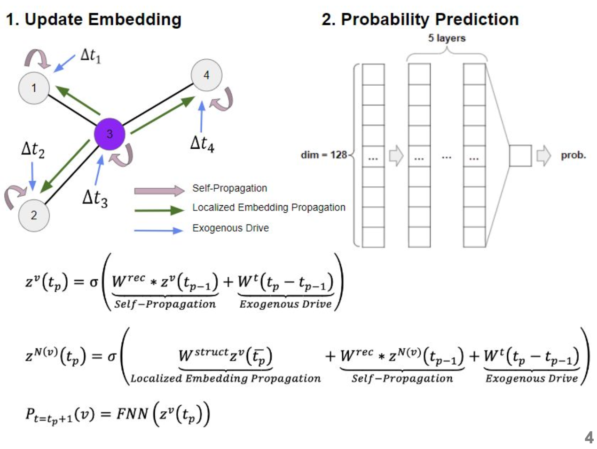

# Earthquake Prediction

[](https://opensource.org/licenses/MIT)

## Description
TENG(Time considering Earthquake Node prediction Graph model) predicts the earthquake event using Node event prediction model inspired by DyRep. This project modifies model used at [Paper](https://openreview.net/forum?id=HyePrhR5KX) and [Github](https://github.com/Harryi0/dyrep_torch).



It initializes with a set of parameters and embeddings, then updates node embeddings based on temporal events and neighborhood interactions. The model includes methods for parameter initialization, state resetting, and node embedding updates without attention mechanisms. It supports negative sampling for training and computes probabilities and time predictions using multi-layer perceptron (MLP) structures. 

This model is designed to handle dynamic node interactions and temporal dependencies efficiently, making it suitable for temporal graph analysis tasks.

## Table of Contents

- [Earthquake Prediction](#earthquake-prediction)
  - [Description](#description)
  - [Table of Contents](#table-of-contents)
  - [Installation](#installation)
  - [Usage](#usage)
    - [Dataset Preparation](#dataset-preparation)
    - [Model Training and Testing](#model-training-and-testing)
      - [Attach three csv files to run the code](#attach-three-csv-files-to-run-the-code)
      - [Run training code](#run-training-code)
    - [About comparison models](#about-comparison-models)
  - [License](#license)

## Installation

You need to install multiple libraries described in below.

````
conda install pandas matplotlib scikit-learn numpy pytorch networkx tqdm
````

## Usage

### Dataset Preparation

You need to prepare the dataset from [Kaggle](https://www.kaggle.com/datasets/alessandrolobello/the-ultimate-earthquake-dataset-from-1990-2023) and name it as Earthquake.csv. With plate_polygon.csv, you can make the dataset from raw data

````
python clustering.py
python clustering_for_NLP.py
````

### Model Training and Testing

By preprocessing and data loader, you can get this three files.

- adj.csv
    - Initial adjacency matrix of each node
    - Matrix form: (num_cluster, num_cluster) 
- cluster_assign.csv 
    - Martix telling if each cluster center is placed in plate
    - Martix form: (num_cluster, 13)
- result.csv
    - Table of earthquake events which includes cluster_number
    - Data form: [time place, status, tsunam, significance, data_type, magnitudo, state, longitude, latitudeepth  date, cluster]

#### Run training code
````
python3.12 train_eval_main_node.py
````

You can change the hyperparameters by providing arguments as follows:
````
python3 train_eval_main_node.py --epochs 2 --batch_size 200 --test_batch_size 100
````


### About comparison models
TENG shows great performance compared to other baseline models. The result of the baseline models can be shown by running codes in comparison_models directory.
There are total three baseline models which are : MLP, HMM and RNN using LSTM.
Put "event.csv" file in the same directory where you are running these ipynb files.


## License

This project is licensed under the [MIT License](LICENSE).